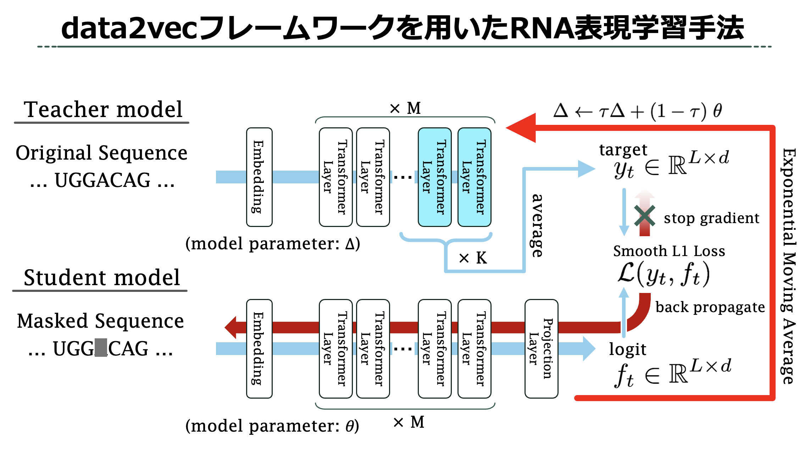

# 卒業研究にて作成した深層学習モデルとその評価モデルのソースコード

## ディレクトリの説明
- pretraining  
    RNAの配列特徴表現を学習する，自己教師あり学習モデルを実装したディレクトリ

- SSpredictor  
    pretrainingから得られるRNA特徴表現を評価するのに使用する，RNA二次構造予測モデルを実装したディレクトリ

- data  
    pretrainingやSSpredcitorの学習で使用されるRNAデータや，モデル実行時の結果などが保存されるディレクトリ

Dockerを用いた環境構築を行なっていたため，Dockerfileとenvironment.ymlもある．

## 作成したRNA表現学習フレームワーク
